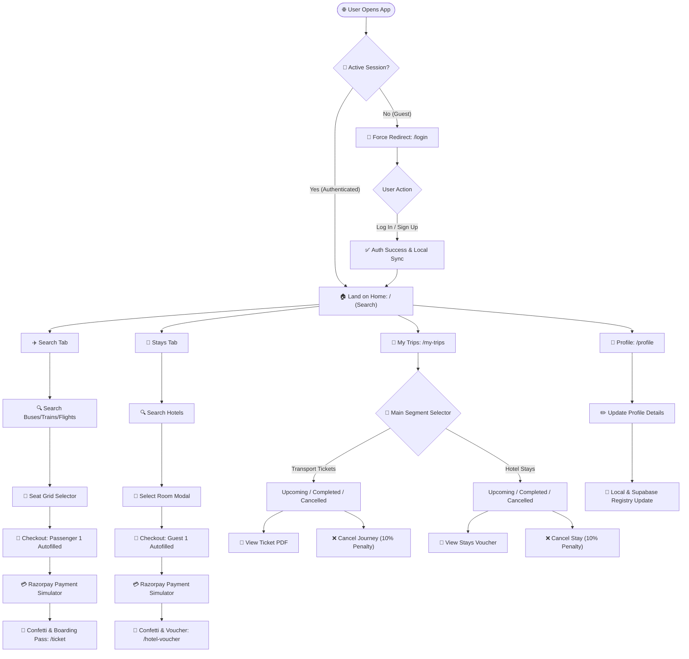

# Application Workflow Tree: Pack Your Bags

The following tree diagram maps out the application states, authentication guards, checkout pipelines, and dashboard pathways.

```mermaid
graph TD
    %% Base Nodes
    StartNode(["🌐 User Opens App"]) --> SessionCheck{"🔑 Active Session?"}
    
    %% Session Gate
    SessionCheck -- "No (Guest)" --> RedirectLogin["🔐 Force Redirect: /login"]
    SessionCheck -- "Yes (Authenticated)" --> HomeView["🏠 Land on Home: / (Search)"]
    
    RedirectLogin --> AuthAction{"User Action"}
    AuthAction -- "Log In / Sign Up" --> AuthSuccess["✅ Auth Success & Local Sync"]
    AuthSuccess --> HomeView
    
    %% Main Dashboard Sections
    HomeView --> NavHome["✈️ Search Tab"]
    HomeView --> NavStays["🏨 Stays Tab"]
    HomeView --> NavTrips["💼 My Trips: /my-trips"]
    HomeView --> NavProfile["👤 Profile: /profile"]
    
    %% Stays Pathway
    NavStays --> SearchStays["🔍 Search Hotels"]
    SearchStays --> HotelSelect["🛌 Select Room Modal"]
    HotelSelect --> CheckoutStays["📝 Checkout: Guest 1 Autofilled"]
    CheckoutStays --> PaymentStays["💳 Razorpay Payment Simulator"]
    PaymentStays --> SuccessConfettiStays["🎉 Confetti & Voucher: /hotel-voucher"]
    
    %% Transport Pathway
    NavHome --> SearchTransit["🔍 Search Buses/Trains/Flights"]
    SearchTransit --> SeatSelection["💺 Seat Grid Selector"]
    SeatSelection --> CheckoutTransit["📝 Checkout: Passenger 1 Autofilled"]
    CheckoutTransit --> PaymentTransit["💳 Razorpay Payment Simulator"]
    PaymentTransit --> SuccessConfettiTransit["🎉 Confetti & Boarding Pass: /ticket"]
    
    %% My Journeys Segmented Dashboard
    NavTrips --> SegmentSelector{"🔀 Main Segment Selector"}
    
    SegmentSelector -- "Transport Tickets" --> TransportSubtabs["Upcoming / Completed / Cancelled"]
    TransportSubtabs --> ViewTicket["🎫 View Ticket PDF"]
    TransportSubtabs --> CancelTrip["❌ Cancel Journey (10% Penalty)"]
    
    SegmentSelector -- "Hotel Stays" --> StaysSubtabs["Upcoming / Completed / Cancelled"]
    StaysSubtabs --> ViewVoucher["🏨 View Stays Voucher"]
    StaysSubtabs --> CancelStay["❌ Cancel Stay (10% Penalty)"]
    
    %% Profile Editor
    NavProfile --> EditForm["✏️ Update Profile Details"]
    EditForm --> ProfileSave["💾 Local & Supabase Registry Update"]
```
